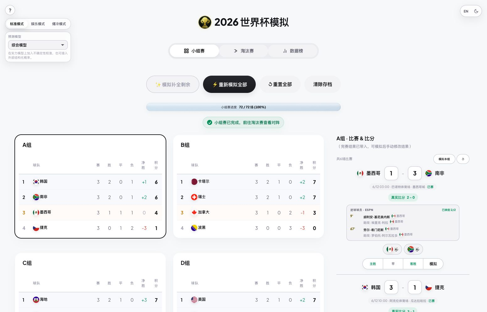
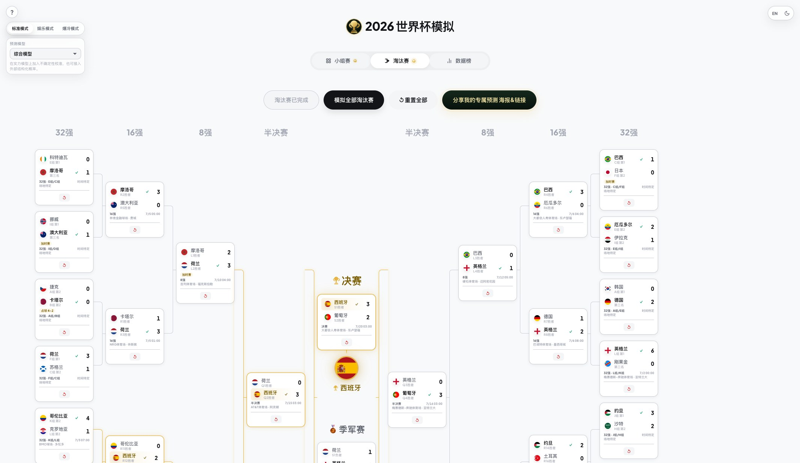
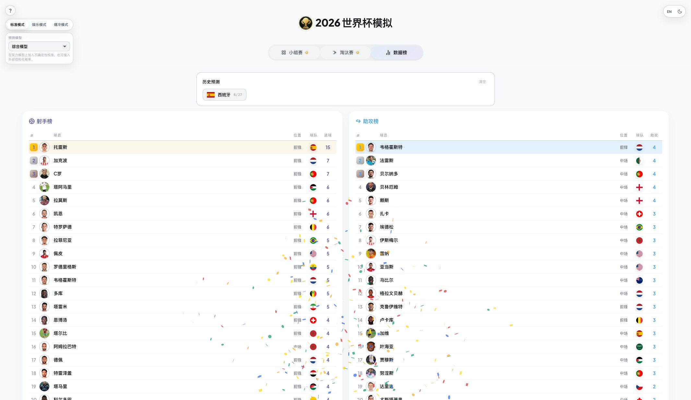
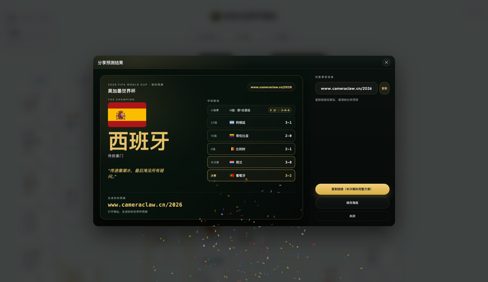

# 2026 World Cup Predictor

> A single-file 2026 World Cup simulator, shareable bracket poster, live-result scorer, and Codex skill for maintaining the whole prediction workflow.

<p align="center">
  <a href="https://www.cameraclaw.cn/2026"><strong>Live Demo</strong></a>
  ·
  <a href="#quick-start">Quick Start</a>
  ·
  <a href="#screenshots">Screenshots</a>
  ·
  <a href="#model-and-data">Model & Data</a>
  ·
  <a href="#codex-skill">Codex Skill</a>
  ·
  <a href="#中文说明">中文说明</a>
</p>

<p align="center">
  
  
  
  
  
</p>

<p align="center">
  
</p>

This project is both a polished browser app and an installable Codex skill. The app lets you simulate all 72 group matches, build the 32-team knockout bracket, inspect scorers and assists, generate a champion poster, copy a short share link, and later score predictions against completed ESPN results.

It is an unofficial fan and software project. It is not affiliated with FIFA, and it is not betting advice.

## Highlights

- Complete 2026 format: 48 teams, 12 groups, 104 total matches.
- One-click simulation for groups, knockout rounds, or the full tournament.
- Three gameplay modes: Standard, Fun, and Upset.
- Three prediction modes: Random baseline, Strength model, and Ensemble model.
- Real completed results can be embedded and shown as actual score context.
- Player-level goal and assist leaderboards.
- Shareable champion poster plus compact `#s=` prediction links.
- Bilingual Chinese/English UI with light/dark themes.
- Live-result utility backed by ESPN's public scoreboard feed.
- Codex skill packaging for launch, validation, live checks, and maintenance.
- Deterministic validation suite for teams, squads, data, JavaScript, and plugin packaging.

## Live Demo

Open the current public build:

[https://www.cameraclaw.cn/2026](https://www.cameraclaw.cn/2026)

The app is static. All prediction state lives in the browser through local storage or URL hashes. No backend is required for normal play.

## Screenshots

| Group stage and live result context | Knockout bracket |
|---|---|
|  |  |

| Scorers and assists | Share poster and short link |
|---|---|
|  |  |

Older generated media is still kept in `docs/` for release notes and historical comparison:

- `docs/banner.png`
- `docs/demo.gif`
- `docs/screenshot-bracket.png`
- `docs/screenshot-leaderboard.png`
- `docs/screenshot-poster.png`

## Quick Start

### Browser mode vs Codex Skill mode

There are two supported ways to use this project:

| Mode | Best for | Start here |
| --- | --- | --- |
| Browser mode | Playing the predictor directly, editing scores, sharing a bracket, and checking the score tab. | Open the live site or run the static app locally. |
| Codex Skill mode | Asking Codex to guide, generate, score, inspect, repair, validate, or explain the workflow. | Use `$world-cup-2026-predictor` followed by a natural-language task. |

Install -> Learn -> Use:

1. Install or open: use the live site for browser play, or install the Codex plugin/skill for agent-assisted workflows.
2. Learn the commands: read the examples below, use the plugin prompt chips, or open the in-app `?` help.
3. Use the workflow: ask Codex for guided play, one-shot simulation, live results, scoring, or maintenance review.
4. Verify the result: browser workflows end with a champion/share/score state; skill workflows end with source output, tests, or validators.

```bash
git clone https://github.com/jiaqi015/WorldCup2026-Predictor-Skill.git
cd WorldCup2026-Predictor-Skill
```

Run a local preview:

```bash
python3 -m http.server 8765
```

Open:

[http://localhost:8765](http://localhost:8765)

For the persistent macOS preview used during development:

```bash
./scripts/manage_local_preview.sh install
./scripts/manage_local_preview.sh status
./scripts/manage_local_preview.sh logs
```

The persistent preview serves the canonical root `index.html`.

## How To Use The App

1. Choose a gameplay mode: Standard, Fun, or Upset.
2. Pick a prediction model: Random baseline, Strength model, or Ensemble model.
3. Simulate or manually edit group-stage scores.
4. Open the knockout tab and simulate one round at a time, or simulate the whole bracket.
5. Inspect the Data tab for top scorers and assists.
6. Generate a champion poster and copy the short share link.
7. When real results are available, compare the prediction against completed matches.

The app autosaves in local storage. Shared links open in a read-only view, so recipients can inspect the bracket without mutating the original prediction.

## Model And Data

The predictor combines a compact browser engine with richer offline data artifacts.

### Runtime Prediction Engine

- `random`: neutral baseline for comparison.
- `strength`: blends team strength, rankings, and available market-style context.
- `ensemble`: adds uncertainty calibration and provider-style probability inputs.
- Standard mode keeps favorites more stable.
- Fun mode can clone star-player behavior for entertainment scenarios.
- Upset mode increases chaos and underdog paths.

Scores are sampled with mode-specific calibration. Goal scorers and assists use position weights plus separated goal-threat and assist-threat multipliers.

### Embedded Tournament Data

- 12 groups and 48 teams in `GD`.
- 72 fixed group fixtures.
- 32-team knockout topology through `R32D`, `R16P`, `QFP`, and `SFP`.
- 528-player simulation roster embedded in `index.html`.
- 1,248-player squad snapshot under `data/`.
- Match schedule, match details, actual-result snapshots, rankings, odds completions, Elo estimates, and player threat maps under `data/`.

Important accuracy notes:

- Some Elo values are marked as low-confidence FIFA-rank regression estimates.
- Some three-way odds are model completions of partial source fields.
- Player and squad data is a dated simulation snapshot, not a final FIFA registration list.
- ESPN public payloads are external contracts and can change.

## Real Result Scoring

Predictions can be scored once real results are available.

| Correct prediction | Points |
|---|---:|
| Group result direction | 3 |
| Exact group score bonus | 2 |
| Team reaches Round of 16 | 5 |
| Team reaches quarterfinal | 8 |
| Team reaches semifinal | 12 |
| Team reaches final | 16 |
| Third place | 15 |
| Runner-up | 20 |
| Champion | 30 |

Group games are compared by fixed fixture slot. Knockout scoring compares which teams reach each round, so it still works when the predicted and real matchups differ.

## Codex Skill

This repository includes an installable Codex skill:

```text
$world-cup-2026-predictor
```

Use it inside Codex for tasks such as:

```text
$world-cup-2026-predictor launch the predictor and guide me through a complete bracket

$world-cup-2026-predictor generate a full tournament prediction and summarize the champion path

$world-cup-2026-predictor check the latest completed World Cup matches from ESPN

$world-cup-2026-predictor explain or score my bracket against real results

$world-cup-2026-predictor review, repair, and validate the predictor data and bundled app
```

Useful skill play styles:

| Style | What Codex should do |
| --- | --- |
| Guided play | Launch the app, keep the browser open, and walk through group stage, knockout, scorer selection, and sharing. |
| One-shot simulation | Complete all 72 group matches and every knockout match, then report champion, runner-up, third place, and share status. |
| Live-results check | Fetch ESPN's current scoreboard feed and report source, fetch time, completed count, and relevant matches. |
| Scoring explainer | Explain or calculate group, knockout, and podium points against real results. |
| Maintenance review | Inspect app/data/skill drift, patch the canonical source, sync the bundled asset, and run validation. |

### Install As A Codex Plugin

```bash
codex plugin marketplace add jiaqi015/WorldCup2026-Predictor-Skill --ref main
codex plugin add world-cup-2026-predictor@world-cup-2026
```

Upgrade later:

```bash
codex plugin marketplace upgrade world-cup-2026
codex plugin add world-cup-2026-predictor@world-cup-2026
```

### Install Only The Skill

```bash
python3 \
  "${CODEX_HOME:-$HOME/.codex}/skills/.system/skill-installer/scripts/install-skill-from-github.py" \
  --repo jiaqi015/WorldCup2026-Predictor-Skill \
  --path skills/world-cup-2026-predictor
```

## Developer Workflow

Root `index.html` is canonical. The bundled skill app must be synced after any app change.

```bash
python3 skills/world-cup-2026-predictor/scripts/sync_predictor_asset.py
python3 skills/world-cup-2026-predictor/scripts/validate_predictor.py
python3 scripts/release_check.py
git diff --check
```

Useful development commands:

```bash
python3 scripts/validate_match_data.py
python3 scripts/validate_prediction_data.py
python3 scripts/validate_squads.py
node --test
```

Live-result check:

```bash
python3 skills/world-cup-2026-predictor/scripts/live_results.py
python3 skills/world-cup-2026-predictor/scripts/live_results.py --json
```

Deploy the current working tree to the existing Vercel project:

```bash
vercel --prod --yes
```

After deploy, verify the actual public route:

```bash
python3 scripts/verify_public_deployment.py
```

## Repository Layout

```text
.
├── index.html
├── data/
│   ├── matches/
│   ├── prediction/
│   ├── rag/kimi-world-cup-report/
│   ├── rankings/
│   ├── schema/prediction-domain.v1.json
│   └── squads/
├── docs/
│   ├── domain-model.md
│   ├── prediction-architecture.md
│   ├── rag-corpus.md
│   └── readme-*.jpg
├── scripts/
│   ├── build_prediction_data.py
│   ├── embed_prediction_data.py
│   ├── live-data and validation helpers
│   └── release_check.py
├── skills/world-cup-2026-predictor/
│   ├── SKILL.md
│   ├── assets/predictor/index.html
│   ├── references/predictor-model.md
│   └── scripts/
├── test/
├── CHANGELOG.md
├── RELEASING.md
├── LICENSE
└── NOTICE.md
```

Key files:

| Path | Purpose |
|---|---|
| `index.html` | Canonical single-file web app |
| `skills/world-cup-2026-predictor/assets/predictor/index.html` | Bundled app shipped with the Codex skill |
| `skills/world-cup-2026-predictor/SKILL.md` | Skill trigger scope and operational workflow |
| `skills/world-cup-2026-predictor/references/predictor-model.md` | Model invariants and maintenance notes |
| `data/prediction/prediction_data_v1.json` | Generated prediction dataset |
| `data/matches/` | Schedule and match detail snapshots |
| `data/schema/prediction-domain.v1.json` | Machine-readable domain catalog |
| `scripts/release_check.py` | Main release validation gate |
| `scripts/embed_prediction_data.py` | Embeds generated data into `index.html` |
| `scripts/manage_local_preview.sh` | Persistent local preview manager |

## Research Corpus

The repository includes a page-cited RAG corpus generated from a 205-page World Cup report.

```bash
python3 scripts/validate_rag_corpus.py
python3 scripts/search_report_rag.py "Brier calibration model drift"
```

See:

- [Domain model](docs/domain-model.md)
- [Prediction architecture](docs/prediction-architecture.md)
- [RAG corpus guide](docs/rag-corpus.md)
- `data/rag/kimi-world-cup-report/chunks.jsonl`

Report-derived claims remain source assertions until independently verified. Retrieved chunks retain page citation and source hash metadata.

## Release Checklist

1. Edit root `index.html` or data/scripts.
2. Sync the bundled skill asset.
3. Run `python3 scripts/release_check.py`.
4. Run `git diff --check`.
5. Browser-test the changed flow locally.
6. Commit and push.
7. Deploy with `vercel --prod --yes`.
8. Verify `https://www.cameraclaw.cn/2026`, not only the Vercel deployment URL.

See [RELEASING.md](RELEASING.md) for semantic versioning, plugin publishing, and tag rules.

## Roadmap

- [x] Complete 48-team browser predictor
- [x] One-click group and knockout simulation
- [x] Strength and ensemble prediction modes
- [x] Player goal and assist threat weighting
- [x] Champion poster and short share links
- [x] Live-result and scoring integration
- [x] Codex skill packaging
- [x] Public Vercel deployment
- [x] Release validation and CI
- [ ] Final official 2026 squad refresh
- [ ] PWA/offline install support

## 中文说明

这是一个完整的 2026 世界杯预测器，也是一个可安装的 Codex Skill。

你可以：

- 模拟 48 队、12 个小组、104 场比赛；
- 自动或手动填写小组赛比分；
- 生成 32 强到决赛的完整淘汰赛路径；
- 查看射手榜和助攻榜；
- 生成冠军海报并复制短分享链接；
- 在真实赛果更新后计算预测得分；
- 让 Codex 负责启动、验证、抓取赛果、维护数据和部署。

双模式使用路径：

| 模式 | 适合谁 | 从哪开始 |
| --- | --- | --- |
| 浏览器模式 | 直接玩预测器、改比分、生成海报、查看评分。 | 打开线上地址，或本地运行静态页面。 |
| Codex Skill 模式 | 让 Codex 陪玩、一键生成、查赛果、解释计分、CR/修复/验证。 | 使用 `$world-cup-2026-predictor` 加一句自然语言任务。 |

安装 -> 学习 -> 使用：

1. 安装或打开：普通用户打开网页，Codex 用户安装 plugin/skill。
2. 学口令：看下面的常用命令、plugin prompt，或打开网页左上角 `?`。
3. 开始用：选择陪玩、一键生成、查赛果、计分解释、维护审查。
4. 验结果：网页以冠军/分享/评分状态为准；skill 以脚本输出、测试和 validator 为准。

在线体验：

[https://www.cameraclaw.cn/2026](https://www.cameraclaw.cn/2026)

本地运行：

```bash
git clone https://github.com/jiaqi015/WorldCup2026-Predictor-Skill.git
cd WorldCup2026-Predictor-Skill
python3 -m http.server 8765
```

然后打开：

[http://localhost:8765](http://localhost:8765)

Codex Skill：

```text
$world-cup-2026-predictor 打开预测器，陪我做一版完整预测
$world-cup-2026-predictor 一键生成完整预测并总结冠军之路
$world-cup-2026-predictor 查询最新已结束的世界杯比赛
$world-cup-2026-predictor 解释我的预测怎么按真实赛果计分
$world-cup-2026-predictor CR 并修复球队、阵容、位置和 ESPN 映射问题
```

维护命令：

```bash
python3 skills/world-cup-2026-predictor/scripts/sync_predictor_asset.py
python3 skills/world-cup-2026-predictor/scripts/validate_predictor.py
python3 scripts/release_check.py
git diff --check
```

预测结果仅用于娱乐和软件实验，不构成事实预测或投注建议。

## Credits

- Match data and live results: ESPN public scoreboard feed
- Flags: [FlagCDN](https://flagcdn.com/)
- Poster rendering: [html2canvas](https://html2canvas.hertzen.com/)
- Celebration effects: [canvas-confetti](https://github.com/catdad/canvas-confetti)
- Browser automation and maintenance workflow: Codex skill tooling

## License

MIT. See [LICENSE](LICENSE) and [NOTICE.md](NOTICE.md).
