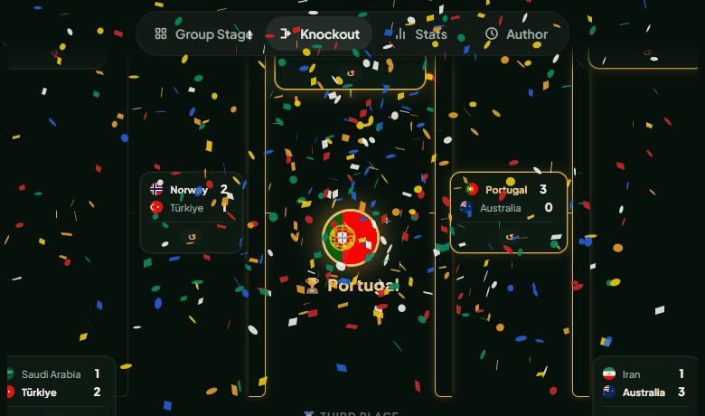

<p align="center">
  
</p>

<h1 align="center">World Cup 2026 Predictor Skill</h1>

<p align="center">
  <strong>A Codex skill for building, launching, scoring, and maintaining a complete 48-team World Cup bracket.</strong>
</p>

<p align="center">
  Codex workflow + interactive web app + live ESPN results
</p>

<p align="center">
  
  
  
  
  <a href="https://www.cameraclaw.cn/2026"></a>
  <a href="LICENSE"></a>
</p>

<p align="center">
  <a href="#quick-start">Quick Start</a> ·
  <a href="https://www.cameraclaw.cn/2026">Live Demo</a> ·
  <a href="#install-from-the-command-line">Install</a> ·
  <a href="#run-the-web-app">Run Web App</a> ·
  <a href="#what-the-skill-does">Capabilities</a> ·
  <a href="#research-data-and-rag">Research Data</a> ·
  <a href="#commands">Commands</a> ·
  <a href="#中文说明">中文说明</a>
</p>

<p align="center">
  <sub>Unofficial fan project. Not affiliated with FIFA or the FIFA World Cup.</sub>
</p>

---

## What This Repository Is

This repository is an installable **Codex Agent Skill** with a bundled,
single-file World Cup predictor.

The skill gives Codex a repeatable workflow to:

- launch an interactive 2026 World Cup bracket;
- generate or complete group-stage and knockout predictions;
- fetch current completed matches from ESPN's public scoreboard feed;
- explain and inspect the prediction scoring model;
- validate all 48 teams, 528 roster slots, mappings, and JavaScript syntax;
- maintain the simulator without allowing the source app and bundled Skill app
  to drift apart.

The same browser application is available from the repository root and is
bundled inside the Skill for standalone local use.

## Quick Start

### Use It In This Repository

```bash
git clone https://github.com/jiaqi015/WorldCup2026-Predictor-Skill.git
cd WorldCup2026-Predictor-Skill
```

Open this repository in Codex and invoke:

```text
$world-cup-2026-predictor launch the interactive bracket
```

Codex discovers the checked-in Skill from:

```text
.agents/skills/world-cup-2026-predictor/
```

The repository keeps the canonical distributable copy at
`skills/world-cup-2026-predictor/`. The `.agents/skills/` entry is a symlink
used for repo-scoped Codex discovery.

## Install From The Command Line

### Recommended: Install The Plugin

The plugin is the sustainable distribution path because Codex tracks its
marketplace, semantic version, and installed cache:

```bash
codex plugin marketplace add jiaqi015/WorldCup2026-Predictor-Skill --ref main
codex plugin add world-cup-2026-predictor@world-cup-2026
```

Start a new Codex thread, then invoke `$world-cup-2026-predictor`.

To receive a later release:

```bash
codex plugin marketplace upgrade world-cup-2026
codex plugin add world-cup-2026-predictor@world-cup-2026
```

### Alternative: Install Only The Skill

Codex's built-in installer can download the Skill directly from this GitHub
repository without a manual ZIP download:

```bash
python3 \
  "${CODEX_HOME:-$HOME/.codex}/skills/.system/skill-installer/scripts/install-skill-from-github.py" \
  --repo jiaqi015/WorldCup2026-Predictor-Skill \
  --path skills/world-cup-2026-predictor
```

Use `--ref v0.2.0` to pin a tagged release. The direct Skill installer does
not overwrite an existing installation, so Plugin installation is preferred
for ongoing updates.

## Run The Web App

Launch the copy bundled with the Skill:

```bash
python3 \
  skills/world-cup-2026-predictor/scripts/serve_predictor.py \
  --port 8000
```

Then open [http://127.0.0.1:8000](http://127.0.0.1:8000).

The root `index.html` can also be opened directly or served with any static
HTTP server. The public demo is available at
[www.cameraclaw.cn/2026](https://www.cameraclaw.cn/2026).

## What The Skill Does

### Interactive Prediction

The bundled app supports:

- the complete 48-team, 12-group tournament format;
- all 72 group matches and the 32-team knockout bracket;
- manual scores, one-match randomization, and full-bracket randomization;
- Normal, Clone, and Chaos simulation modes;
- strength-weighted scores and controlled knockout upsets;
- position-weighted scorers and assists;
- top-scorer and assist leaderboards;
- bilingual UI and light/dark themes;
- local autosave and shareable prediction URLs;
- a 1080 x 1620 champion poster with a QR code;
- live scoring against completed tournament results.

### Live Result Checks

The Skill queries ESPN's public World Cup scoreboard feed and can return:

- scheduled match count;
- completed match count;
- completed scores and stages;
- upcoming fixtures;
- machine-readable JSON for follow-on analysis.

Current or live claims must always come from a fresh fetch. The ESPN endpoint,
stage IDs, team spellings, and payload shape are treated as external contracts
that may change.

### Validation And Maintenance

The validator checks:

- valid Skill metadata;
- 12 groups and 48 unique teams;
- exactly 11 simulation players per team;
- complete flag, English-name, and position mappings;
- the ESPN integration marker and 104-match scoring model;
- inline JavaScript syntax when Node.js is available;
- byte-for-byte synchronization between the root app and bundled Skill asset.

## Example Prompts

```text
$world-cup-2026-predictor launch the predictor and generate a complete bracket

$world-cup-2026-predictor check the latest completed World Cup matches

$world-cup-2026-predictor explain how my bracket is scored against real results

$world-cup-2026-predictor validate the teams, squads, positions, and ESPN mappings

$world-cup-2026-predictor update the simulator after a squad or API change
```

The simulation is for entertainment and software experimentation. It is not a
factual forecast or betting recommendation.

## Commands

Set the Skill directory when running commands from the repository root:

```bash
SKILL_DIR="skills/world-cup-2026-predictor"
```

### Launch The Bundled App

```bash
python3 "$SKILL_DIR/scripts/serve_predictor.py" --port 8000
```

Then open [http://127.0.0.1:8000](http://127.0.0.1:8000).

### Fetch Current Results

```bash
python3 "$SKILL_DIR/scripts/live_results.py"
python3 "$SKILL_DIR/scripts/live_results.py" --json
```

### Validate The Skill And Predictor

```bash
python3 "$SKILL_DIR/scripts/validate_predictor.py"
python3 scripts/release_check.py
git diff --check
```

### Synchronize The Bundled App

The root `index.html` is the canonical web application and the source intended
for a future GitHub Pages deployment. After editing it, update the copy shipped
inside the Skill:

```bash
python3 "$SKILL_DIR/scripts/sync_predictor_asset.py"
python3 "$SKILL_DIR/scripts/sync_predictor_asset.py" --check
```

## Research Data And RAG

The repository includes a page-cited research corpus generated from the
205-page Kimi World Cup report:

- [Domain model](docs/domain-model.md)
- [RAG corpus guide](docs/rag-corpus.md)
- [Prediction architecture](docs/prediction-architecture.md)
- `data/schema/prediction-domain.v1.json`
- `data/rag/kimi-world-cup-report/chunks.jsonl`

Regenerate, validate, and test retrieval:

```bash
python3 scripts/build_report_rag.py \
  --source /Users/jiaqi/Downloads/Kimi_2026_World_Cup_Report.pdf
python3 scripts/validate_rag_corpus.py
python3 scripts/search_report_rag.py "Brier 校准 模型漂移"
```

Report-derived claims remain source assertions until independently verified.
Every retrieved chunk carries a page citation and source PDF SHA-256.

The predictor also carries a dated ESPN public roster snapshot for all 48
teams: 1,248 players with squad number, position, age, nationality, and local
photo metadata. It improves roster-aware simulation and player selection, but
it is a source snapshot rather than a final FIFA registration list.

```bash
python3 scripts/fetch_squads.py
python3 scripts/fix_squad_issues.py
python3 scripts/crawl_photos.py
python3 scripts/generate_avatars.py
python3 scripts/update_index.py
python3 skills/world-cup-2026-predictor/scripts/sync_predictor_asset.py
python3 scripts/release_check.py
```

## Repository Layout

```text
.
├── .agents/
│   ├── plugins/marketplace.json
│   └── skills/world-cup-2026-predictor -> ../../skills/world-cup-2026-predictor
├── .codex-plugin/plugin.json
├── .github/workflows/validate.yml
├── skills/world-cup-2026-predictor/
│   ├── SKILL.md
│   ├── agents/openai.yaml
│   ├── assets/predictor/index.html
│   ├── references/predictor-model.md
│   └── scripts/
│       ├── live_results.py
│       ├── serve_predictor.py
│       ├── sync_predictor_asset.py
│       └── validate_predictor.py
├── index.html
├── data/
│   ├── rag/kimi-world-cup-report/
│   └── schema/prediction-domain.v1.json
├── scripts/
│   ├── build_report_rag.py
│   ├── search_report_rag.py
│   ├── validate_rag_corpus.py
│   └── release_check.py
├── CHANGELOG.md
├── RELEASING.md
├── docs/
├── assets/
├── LICENSE
└── NOTICE.md
```

| Path | Purpose |
|---|---|
| `SKILL.md` | Trigger scope and operational workflow for Codex |
| `agents/openai.yaml` | Skill display metadata and default prompt |
| `assets/predictor/index.html` | Self-contained app shipped with the Skill |
| `references/predictor-model.md` | Data model, invariants, and maintenance notes |
| `scripts/serve_predictor.py` | Local static server for the bundled app |
| `scripts/live_results.py` | Fresh ESPN result and fixture lookup |
| `scripts/validate_predictor.py` | Deterministic structural validation |
| `scripts/sync_predictor_asset.py` | Root app to Skill asset synchronization |
| `/index.html` | Canonical web app and future GitHub Pages source |
| `.codex-plugin/plugin.json` | Plugin identity, version, and install metadata |
| `.agents/plugins/marketplace.json` | GitHub-backed Codex marketplace entry |
| `scripts/release_check.py` | One-command release validation gate |
| `docs/domain-model.md` | Current entities and the expanded forecast lifecycle |
| `docs/rag-corpus.md` | Corpus generation, retrieval, and citation rules |
| `data/rag/kimi-world-cup-report/` | Page and chunk JSONL for RAG ingestion |
| `data/schema/prediction-domain.v1.json` | Machine-readable entity catalog |
| `RELEASING.md` | Versioning, tagging, and publishing workflow |

## Predictor Model

The simulator uses:

- five team-strength tiers;
- a score distribution weighted by strength difference;
- decisive knockout matches;
- an upset score cap in Normal mode;
- position-aware scorer and assist selection;
- head-to-head criteria before overall goal difference in group ranking.

Live prediction scoring awards:

| Correct prediction | Points |
|---|---:|
| Group result direction | 3 |
| Exact group score bonus | 2 |
| Team reaches Round of 16 | 5 |
| Team reaches quarterfinal | 8 |
| Team reaches semifinal | 12 |
| Team reaches final | 16 |
| Third place | 15 |
| Runner-up | 20 |
| Champion | 30 |

Group games are compared by fixed fixture slot. Knockout progress is compared
by the set of teams reaching each round, so scoring remains valid even when the
predicted and real matchups differ.

## Demo

<p align="center">
  
</p>

<p align="center">
  
</p>

<p align="center">
  
  <br>
  
</p>

## Development Workflow

1. Edit the canonical root `index.html`.
2. Synchronize the bundled Skill asset.
3. Run `python3 scripts/release_check.py` and `git diff --check`.
4. Launch the bundled app, not only the root app.
5. Complete all 72 group matches and the knockout bracket.
6. Confirm a champion appears and Share becomes enabled.
7. Check browser warnings and errors.
8. For ESPN changes, verify at least one completed event maps into
   `ACTUAL_RESULTS`.

Use semantic versioning, update `CHANGELOG.md`, and follow
[RELEASING.md](RELEASING.md) for every published release. Never change a
published plugin without bumping `.codex-plugin/plugin.json`; Codex caches
plugins by marketplace, name, and version.

Do not commit copyrighted music. The predictor is designed to work without
bundled audio.

## Data And Accuracy Notes

- Team and player data is a simulation-oriented 2024-2026 snapshot.
- Final official 2026 squads should be rechecked before relying on individual
  player names.
- Live results depend on ESPN's public, unauthenticated endpoint.
- Player photos and flags are loaded at runtime from Wikipedia and FlagCDN.
- Poster generation and confetti use `html2canvas` and `canvas-confetti`.
- The core prediction engine remains client-side and requires no backend.

## Roadmap

- [x] Repo-scoped Codex Skill
- [x] Bundled standalone predictor
- [x] Local launch command
- [x] Live ESPN result command
- [x] Structural and JavaScript validation
- [x] Root app and Skill asset synchronization
- [x] Full browser smoke test
- [x] Codex plugin packaging and GitHub marketplace
- [x] Semantic versioning, changelog, release gate, and CI
- [ ] Final official 2026 squad refresh
- [x] Public demo deployment at `www.cameraclaw.cn/2026`
- [ ] PWA support

## 中文说明

这是一个以 **Codex Skill 为主、交互式网页预测器为内置工具** 的
2026 世界杯项目。

Skill 名称：

```text
$world-cup-2026-predictor
```

它可以让 Codex：

- 启动完整的 48 队世界杯预测器；
- 自动或手动生成小组赛与淘汰赛结果；
- 查询 ESPN 当前已完成比赛和后续赛程；
- 按真实赛果计算预测得分；
- 检查 48 队、528 个阵容槽位、位置和名称映射；
- 在修改球队、阵容、算法或 API 后执行完整验证；
- 保证 GitHub Pages 页面与 Skill 内置网页保持同步。

### 中文快速开始

推荐使用 Plugin 安装，这样后续版本升级有明确的 marketplace 和版本号：

```bash
codex plugin marketplace add jiaqi015/WorldCup2026-Predictor-Skill --ref main
codex plugin add world-cup-2026-predictor@world-cup-2026
```

只安装单个 Skill：

```bash
python3 \
  "${CODEX_HOME:-$HOME/.codex}/skills/.system/skill-installer/scripts/install-skill-from-github.py" \
  --repo jiaqi015/WorldCup2026-Predictor-Skill \
  --path skills/world-cup-2026-predictor
```

在仓库内开发：

```bash
git clone https://github.com/jiaqi015/WorldCup2026-Predictor-Skill.git
cd WorldCup2026-Predictor-Skill
```

在 Codex 中输入：

```text
$world-cup-2026-predictor 启动预测器并生成一套完整对阵
```

查询当前赛果：

```text
$world-cup-2026-predictor 查询最新已结束的世界杯比赛
```

直接运行工具：

```bash
SKILL_DIR="skills/world-cup-2026-predictor"
python3 "$SKILL_DIR/scripts/serve_predictor.py" --port 8000
python3 "$SKILL_DIR/scripts/live_results.py"
python3 "$SKILL_DIR/scripts/validate_predictor.py"
python3 scripts/release_check.py
```

长期迭代遵循 `RELEASING.md`：修改、同步、验证、更新
`CHANGELOG.md`、提升语义化版本、打 `vX.Y.Z` 标签并发布。

预测结果仅用于娱乐和软件实验，不构成事实预测或投注建议。

## Credits

- Match data: ESPN public scoreboard feed
- Flags: [FlagCDN](https://flagcdn.com/)
- Player photos: Wikipedia REST API
- Poster rendering: [html2canvas](https://html2canvas.hertzen.com/)
- Celebration: [canvas-confetti](https://github.com/catdad/canvas-confetti)
- Commentary: original tribute text, not quotations from a specific commentator

## License

MIT. See [LICENSE](LICENSE) and [NOTICE.md](NOTICE.md).
