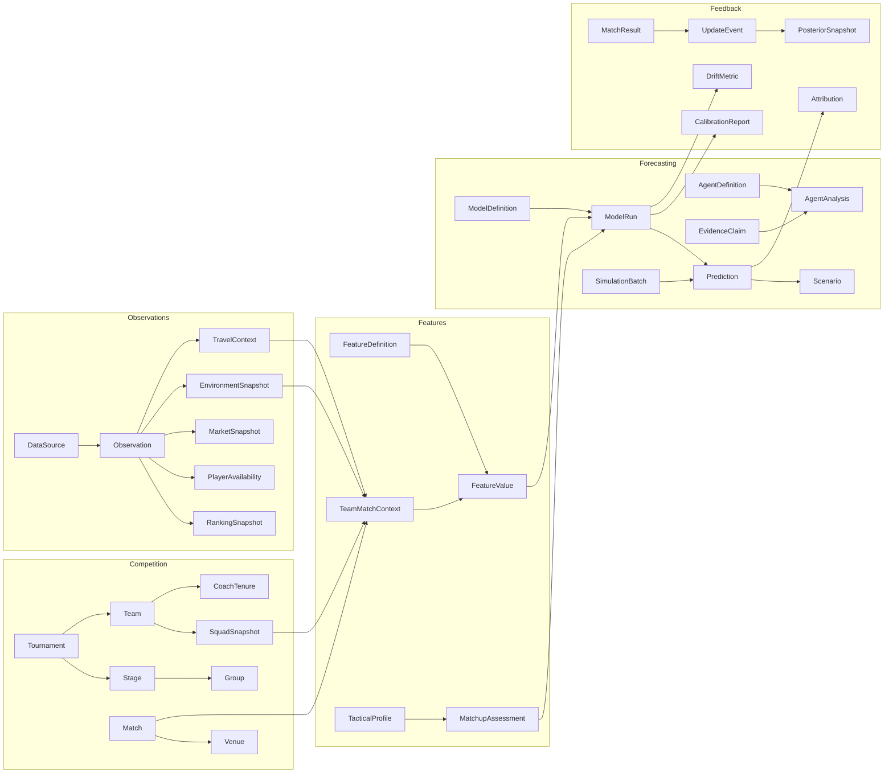

# World Cup Predictor Domain Model

## Current Core

The shipped predictor currently has five explicit entity factories inside
`PredictionEngine`:

- `Team`
- `Player`
- `Coach`
- `Match`
- `Prediction`

The application also has important implicit entities stored in legacy maps and
runtime state:

- `TournamentGroup` and `Standing` in `GD` and calculated tables.
- `Squad` and `PlayerPosition` in `PL`, `POS`, and the 26-player source data.
- `BracketSlot` and `StageTopology` in `R32D`, `R16P`, `QFP`, and `SFP`.
- `MatchEvent` in scorer and assist logs.
- `ActualResult` in `ACTUAL_RESULTS`.
- `PredictionRun` in `gm`, `ko`, local storage, and share payloads.
- `PredictionStrategy` and `GameplayMode` in the engine registries.

The current data is enough for an offline bracket simulator, but facts,
derived features, model outputs, and UI state are still mixed together.

## Design Lessons From The Report

The Kimi report suggests four changes that matter more than adding isolated
fields:

1. Every observation needs provenance, granularity, freshness, sample size,
   and quality status. The report separates seven source layers and uses a
   four-part availability check (PDF pp. 21-22).
2. Model inputs should be versioned feature values rather than permanent team
   attributes. Elo, xG, squad depth, travel, weather, market probability, and
   momentum all change over time (PDF p. 23).
3. Predictions need uncertainty and evidence. A point probability without a
   confidence interval, disagreement measure, or source trail is incomplete
   (PDF pp. 31-33).
4. Forecasting is a lifecycle. Match results, injuries, discipline, coaching
   changes, and drift metrics create new posterior snapshots rather than
   mutating historical predictions (PDF pp. 169-174).

Report numbers and model claims are stored as source assertions until they are
independently verified.

## Bounded Contexts



## Entity Catalog

### Competition Facts

| Entity | Purpose | Stable identity |
| --- | --- | --- |
| `Tournament` | Rules, dates, hosts, stages, qualification topology | tournament ID |
| `Stage` | Group, round of 32, round of 16, quarterfinal, semifinal, final | tournament + stage |
| `Group` | Team membership and qualification rules | tournament + group code |
| `Team` | Stable national-team identity and display names | canonical team ID |
| `Player` | Stable person identity independent of a squad edition | canonical player ID |
| `Coach` | Stable coach identity | canonical coach ID |
| `SquadSnapshot` | Selected players at a point in time | team + effective time |
| `CoachTenure` | Coach-team relationship and tactical regime | team + coach + interval |
| `Match` | Scheduled contest between two teams | provider-neutral match ID |
| `Venue` | Stadium, city, coordinates, altitude, roof, surface | venue ID |

### Observations And Provenance

`Observation` is the common envelope for external facts:

```json
{
  "id": "obs_...",
  "subject_type": "team",
  "subject_id": "team_esp",
  "metric": "elo_rating",
  "value": 2041,
  "observed_at": "2026-06-05T00:00:00Z",
  "effective_from": "2026-06-05T00:00:00Z",
  "source_id": "eloratings",
  "source_record_id": "esp-2026-06-05",
  "granularity": "team",
  "sample_size": 24,
  "freshness_status": "current",
  "quality_score": 0.94,
  "verification_status": "source_assertion"
}
```

Specialized snapshots project observations into convenient structures:

- `RankingSnapshot`
- `FormSnapshot`
- `SquadSnapshot`
- `PlayerAvailability`
- `MarketSnapshot`
- `EnvironmentSnapshot`
- `TravelContext`

### Derived Features

Keep definitions separate from values:

- `FeatureDefinition`: name, unit, direction, formula version, required sources,
  leakage policy, applicable model.
- `FeatureValue`: subject, match context, value, uncertainty, computation time,
  input observation IDs, feature definition version.
- `TeamMatchContext`: the immutable feature set available before one match.
- `TacticalProfile`: formation tendencies, pressing, possession, transition,
  set-piece and discipline characteristics.
- `MatchupAssessment`: directional interaction between two tactical profiles.

This avoids storing transient values such as Elo, travel distance, WBGT, injury
impact, and market probability directly on `Team`.

### Forecasting

| Entity | Key fields |
| --- | --- |
| `ModelDefinition` | model family, version, features, parameters, calibration version |
| `ModelRun` | as-of time, code version, data snapshot IDs, seed, status |
| `AgentDefinition` | role, allowed evidence, output schema, aggregation weight |
| `AgentAnalysis` | claims, probabilities, confidence, evidence IDs, dissent |
| `EvidenceClaim` | assertion, source chunk IDs, verification state, polarity |
| `SimulationBatch` | iteration count, seed policy, convergence diagnostics |
| `Prediction` | probabilities, score distribution, interval, explanation, run ID |
| `Scenario` | changed assumptions and probability deltas from a baseline |

`Prediction` should be immutable. A new injury or result creates another
`ModelRun` and `Prediction`, linked to the prior version.

### Feedback And Governance

- `MatchResult`: observed score and events.
- `UpdateEvent`: result, injury, suspension, coaching change, weather update,
  market movement, or data correction.
- `PosteriorSnapshot`: post-update team and tournament probabilities.
- `Attribution`: data error, assumption error, contextual miss, random event,
  or methodological limitation.
- `CalibrationReport`: Brier score, ranked probability score, reliability bins,
  interval coverage.
- `DriftMetric`: feature drift, calibration drift, disagreement drift,
  convergence status.

## Required Metadata

Every fact, feature, and prediction should carry:

- `as_of`: what was knowable at prediction time.
- `effective_from` and optional `effective_to`: validity interval.
- `source_ids`: direct lineage.
- `version`: schema or algorithm version.
- `uncertainty`: interval or distribution where applicable.
- `verification_status`: unverified source claim, cross-checked, official, or
  derived.
- `created_at`: audit timestamp.

## Migration Path

1. Keep the single-file UI and current maps as a read model.
2. Introduce canonical JSON for teams, players, matches, and venues.
3. Wrap rankings, squads, results, and environments in observation envelopes.
4. Build `TeamMatchContext` before each simulation.
5. Persist immutable `ModelRun` and `Prediction` records.
6. Add update events, calibration, attribution, and drift only after the
   prediction history is durable.

This sequence improves auditability without forcing a large UI rewrite.

## Machine-Readable Assets

- `data/schema/prediction-domain.v1.json` catalogs bounded contexts,
  relationships, required fields, lineage, and lifecycle invariants.
- `data/rag/kimi-world-cup-report/chunks.jsonl` supplies page-cited evidence
  chunks that can back `EvidenceClaim.source_chunk_ids`.
- `docs/rag-corpus.md` documents regeneration, retrieval, and citation rules.
